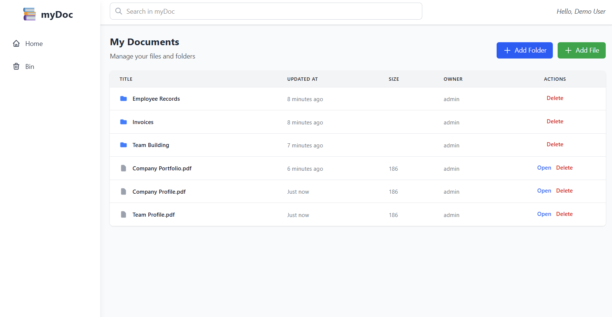
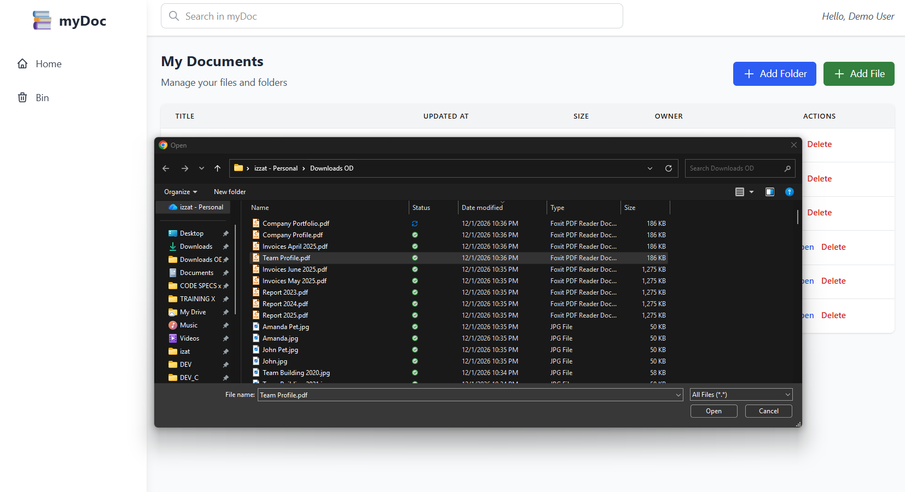
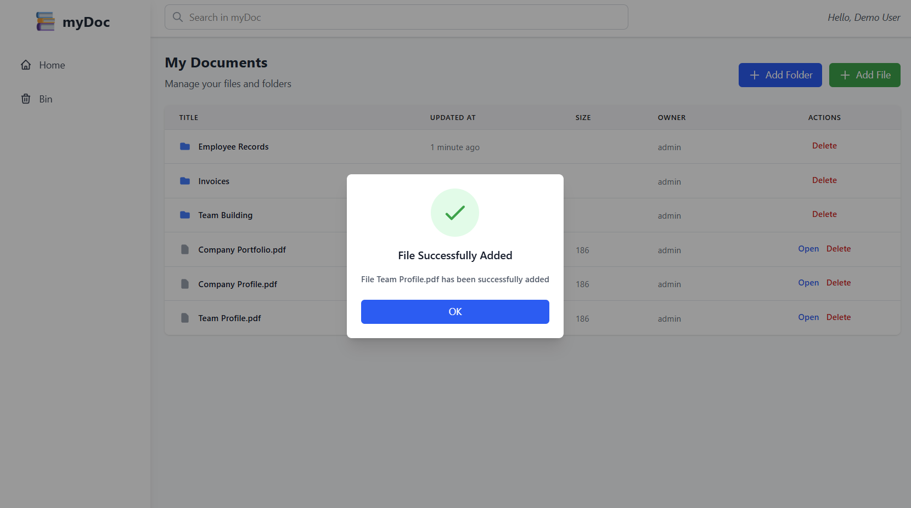
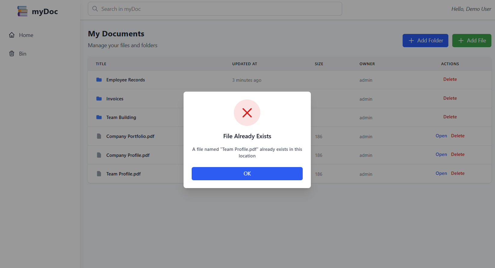
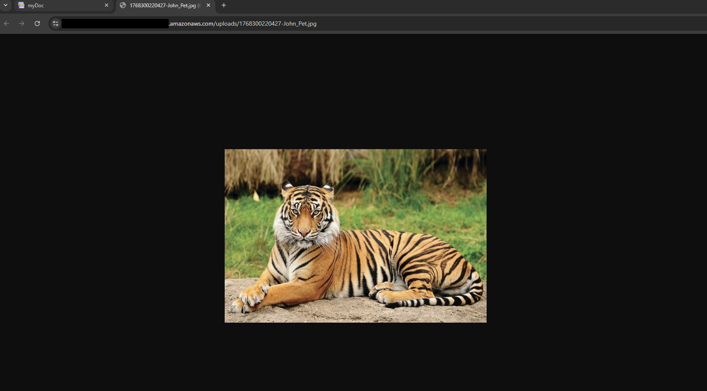
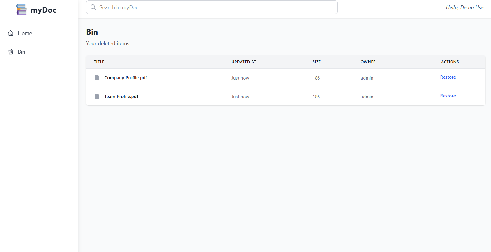
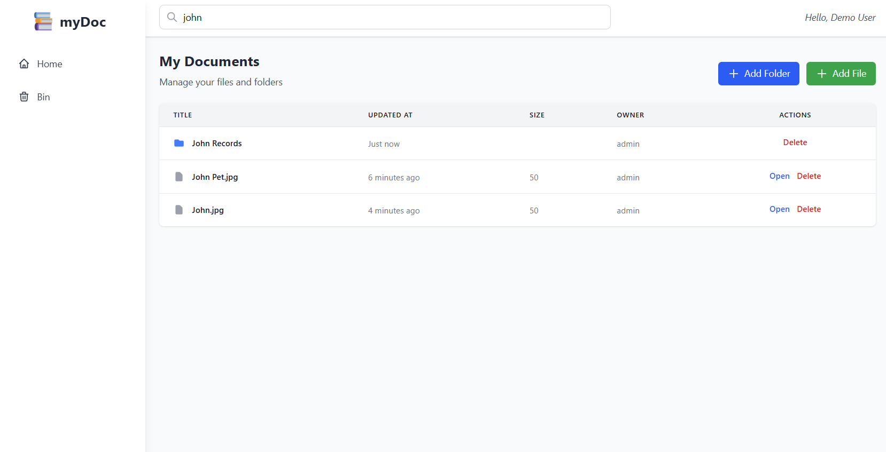
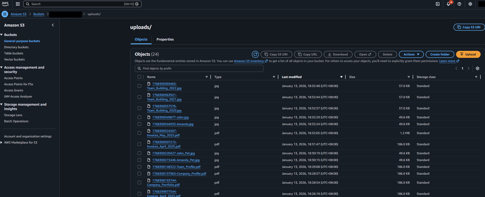
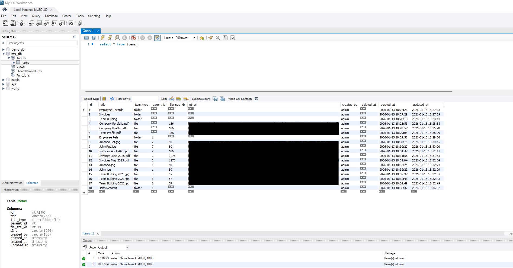

# myDoc Document Management System - Frontend

A modern, production-ready document management system built with Next.js 16, featuring hierarchical folder structure, hierarchical folder/file organization, soft delete capabilities, AWS S3 object storage integration and a clean, responsive, intuitive user interface. 

> **Node.js Backend Repository**: [https://github.com/Izzat1098/my-doc-mgmt-backend](https://github.com/Izzat1098/my-doc-mgmt-backend)

## 📑 Table of Contents

- [Screenshots](#-screenshots)
- [Features](#-features)
- [Technologies Used](#️-technologies-used)
- [Project Structure](#-project-structure)
- [AWS S3 Integration](#️-aws-s3-integration)
- [Setup & Installation](#-setup--installation)
- [Code Quality](#-code-quality)
- [Future Enhancements](#-future-enhancements)
- [License](#-license)


## 📸 Screenshots


*Main dashboard showing folder structure and file organization*



*Adding file*



*File upload successful*



*File upload failed due to existing file name*



*File can be viewed on another tab after clicking "Open"*



*Any deleted files/folders can be viewed in "Bin" and restored*



*Search functionality to find files and folders*



*The uploaded files can be found on AWS S3 Bucket*



*The database storing files/folders data and S3 Url can be viewed on MySQL Workbench or CLI*


## ✨ Features

- ✅ **Hierarchical Folder Management**: Folder structure with unlimited nesting using parent-child relationships
- ✅ **Folder/File Search**: Search across all documents and folders
- ✅ **Soft Delete**: Recover deleted items from recycle bin
- ✅ **AWS S3 Integration**: Direct upload from client using presigned URLs
- ✅ **Type Safety**: Full TypeScript with strict type checking
- ✅ **Layered Architecture**: Clean separation of concerns
- ✅ **Code Quality**: ESLint + Prettier
- ✅ **Responsive Design**: Mobile-first design with Tailwind CSS
- ✅ **Modern UI**: Clean, intuitive interface with modal interactions

## 🛠️ Technologies Used

### Core Technologies
- **Web Framework**: Next.js 16, React 19
- **Language**: TypeScript 5
- **Styling & UI**: Tailwind CSS 4, PostCSS
- **State Management**: React Hooks (useState, useRef, useSearchParams)

### Development Tools
- **Build Tool**: Next.js Dev Tools
- **Linting**: ESLint
- **Formatting**: Prettier, auto-sort import plugin
- **Type Checking**: TypeScript strict mode


## 📁 Project Structure

```
my-doc-mgmt-frontend/
├── app/                         # Next.js App Router directory
│   │
│   ├── components/              # React components
│   │   ├── AddFolderModal.tsx   # Modal for creating folders
│   │   ├── DocumentList.tsx     # Main document/folder list view
│   │   ├── InfoModal.tsx        # Notification modal
│   │   ├── Navbar.tsx           # Top navigation bar
│   │   └── SearchBar.tsx        # Document search component
│   │
│   ├── globals.css              # Global styles and Tailwind imports
│   ├── layout.tsx               # Root layout with metadata
│   └── page.tsx                 # Home page (main document view)
│   
├── lib/                         # Utility libraries
│   ├── api.ts                   # Backend API client functions
│   ├── s3.ts                    # AWS S3 upload utilities
│   └── utils.ts                 # Shared utility functions
│   
├── public/                      # Static assets
│   
├── types/                       # TypeScript type definitions
│   └── document.ts              # Document/Folder type interface
│   
├── eslint.config.mjs            # ESLint configuration
├── .prettierrc                  # Prettier configuration
├── next.config.ts               # Next.js configuration
├── package.json                 # Dependencies and scripts
├── postcss.config.mjs           # PostCSS configuration
├── tailwind.config.js           # Tailwind CSS configuration
├── tsconfig.json                # TypeScript configuration
└── README.md                    # This file
```


## ☁️ AWS S3 Integration

Refer to the documentation in the Backend repo for details on AWS S3 integration (LINK HERE)


## 🚀 Setup & Installation

### Prerequisites

- **Node.js** 24.x or higher
- **npm** 9.x or higher
- **Backend API** running (see backend repository)

### 1. Clone the Repository

```bash
git clone <repository-url>
cd my-doc-mgmt-frontend
```

### 2. Install Dependencies

```bash
npm install
```

### 3. Configure Environment Variables

Copy `.env.example` file, edit in your actual values and rename to `.env`

### 4. Run the Application

#### Development Mode
```bash
npm run dev
```
Then navigate to http://localhost:3000

#### Production Build
```bash
npm run build
npm run start
```


## 🔍 Code Quality

### Linting (ESLint)
Enforces code quality and Next.js best practices
```bash
# Check for issues
npm run lint

# Auto-fix issues
npm run lint:fix
```

**Configuration**: `eslint.config.js`
- Next.js recommended rules + TypeScript support
- Strict type checking enabled

### Formatting (Prettier)
Ensures consistent code formatting
```bash
# Format all files
npm run format
```

**Configuration**: `.prettierrc`
- Use single quote
- Auto-sort import statements


## 🚧 Future Enhancements

The following are potential features that can be implemented to the application:

### User Management and Authentication
- User signup, login and authentication
- Separation of documents based on users in Database

### Potential Caching Layers
To improve app performance and user experience, we can do:
- Client-side caching to reduce network calls

### Enhanced Testing
- Unit tests for individual functions
- Integration tests
- End-to-end testing (Playwright, etc)

### Additional Features
- Folder breadcrumbs
- Share links with expiration
- Real-time notifications (WebSockets)
- Audit logs
- Dark mode


## 📄 License

This project is licensed under the MIT License - see the [LICENSE](LICENSE) file for details.


## 👥 Contributing

Contributions are welcome! Please ensure:
1. All tests pass (`npm test`)
2. Code is linted (`npm run lint`)
3. Code is formatted (`npm run format`)
4. TypeScript compiles without errors (`npm run build`)


## 📞 Support

For issues and questions, please open an issue in the GitHub repository.

---
